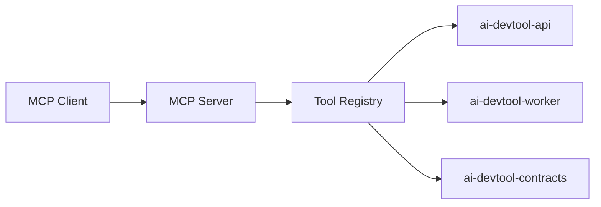
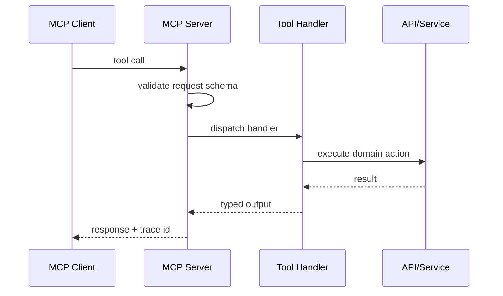

# ai-devtool-mcp-server

Model Context Protocol (MCP) server for AI DevTool workflow tools/resources/prompts.

## What This Repo Owns
- MCP transport endpoints (stdio/SSE).
- Tool registry, schema validation, and policy enforcement.
- MCP resources and prompt catalog for code review and repository chat.

## Bounded Context
- Owns MCP compatibility and tool exposure.
- Does not own core business API lifecycle (api) or UI rendering (web).

## System Design Diagram

## Tool Invocation Flow

## Planned MVP Tools
- repo_index_status
- repo_search
- repo_read_file
- review_diff
- review_pr_summary
- prompt_catalog_list

## Local Development
1. npm install
2. npm run typecheck
3. npm run test
4. npm run lint
5. API-backed stdio server: `API_BASE_URL=http://127.0.0.1:3001 npm run start:stdio`
6. End-to-end local smoke (boots API + MCP and exercises tools): `npm run e2e:local`

## Run and Deployment Notes
- Required runtime env: `API_BASE_URL` (defaults to `http://localhost:3001` if not set).
- Stdio startup command: `npm run start:stdio`.
- Expected MCP tools in current phase:
    - `repo_index_status`
    - `repo_search`
    - `review_start`
    - `review_status`
- For local deployment rehearsal, run `npm run e2e:local` before publishing to preview/staging.

## Quality and Safety Requirements
- All tool contracts validated via shared schemas.
- Allowlist-based tool dispatch.
- Audit logging for every tool invocation.
